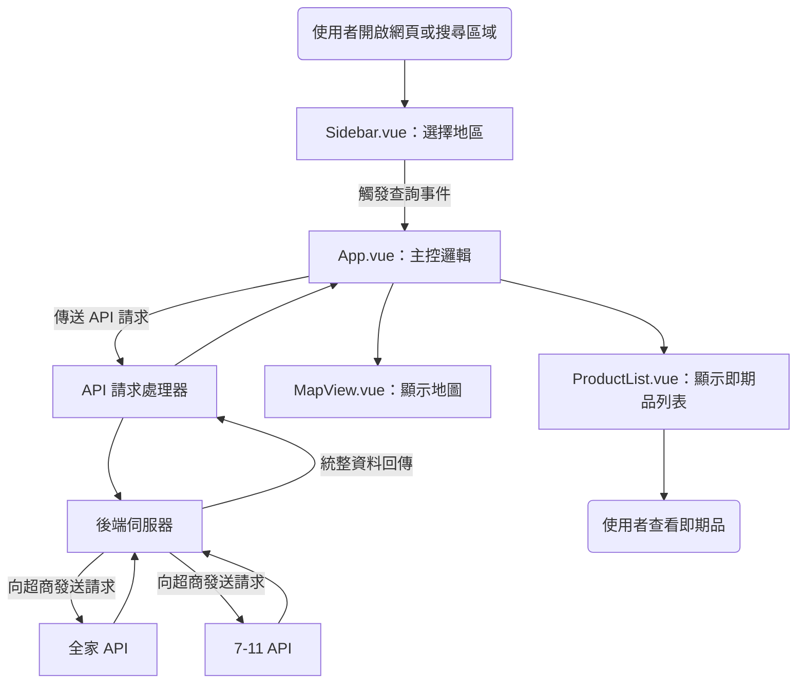
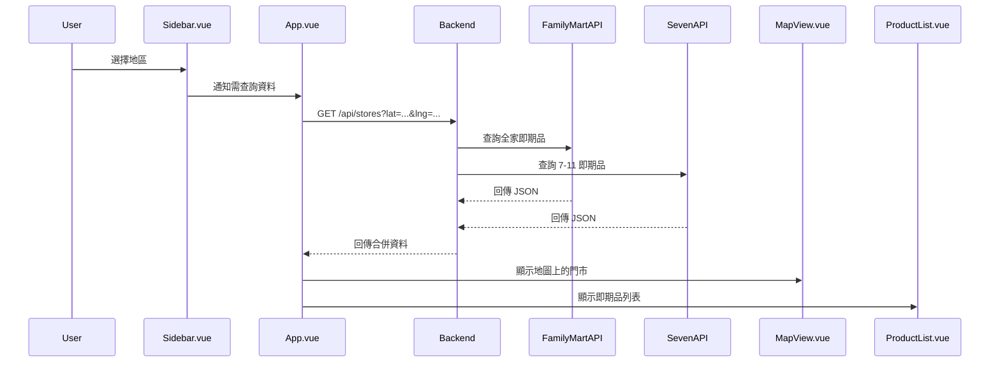
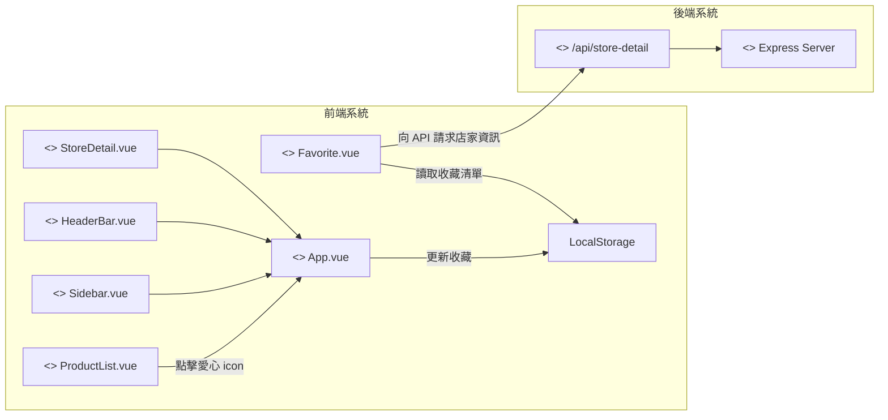

# Vue 3 + Vite + Leaflet 地圖專案

這是一個使用 Vue 3 + Vite 建立的前端專案，整合 Leaflet 地圖，提供行政區篩選、地圖標記與全畫面響應式設計。

---

## 🧱 環境建置

## 安裝需求

- **Node.js 18 或以上版本**
- **npm 或其他套件管理工具（如 pnpm、yarn）**

### 安裝流程

1. 建立專案

```bash
cd vueProject
```

2. 安裝依賴套件

```bash
npm install
npm install leaflet
```

3. 啟動開發伺服器
```bash
npm run dev
```
## 後端Server
此專案搭配一個 Node.js + Express 的後端伺服器，用來串接即期品 API（如 7-11、全家等）。
### 安裝與啟動流程
1. 進入後端資料夾（server）：
```bash
cd server
```

2. 安裝依賴套件：
```bash
npm install
```

3. 啟動伺服器（預設 port: 3001）：
```bash
node index.js
```
後端啟動後會提供 API，例如：
```bash
POST http://localhost:3001/api/stores
```

---

## 📦 打包部署
執行下列指令來建立靜態檔案：
```
npm run build
```
產出的 /dist 可部署至 GitHub Pages、Netlify、Vercel 或其他靜態網頁伺服器。


---
## 📁 專案結構
```bash
my-map-app/
├─vueProject
│   ├─ public/
│   │   └─ data/
│   │       ├─ taiwan_districts.json     # 縣市與區域資料
│   │       └─ shops.json                # 商家地圖資料
│   └─ src/
│       ├─ assets/
│       │   └─ main.css                  # 全域樣式檔案
│       ├─ components/
│       │   ├─ Sidebar.vue
│       │   ├─ ProductList.vue
│       │   ├─ HeaderBar.vue
│       │   ├─ Menu.vue
│       │   ├─ StoreDetail.vue
│       │   ├─ Favorite.vue
│       │   └─ MapView.vue
│       ├─ App.vue
│       └─ main.js
├─ server/
│       ├─ data/
│       │   └─ 711_stores.json     # 7-11 門市補充資料
│       ├─ routes/
│       │   └─ shopRoutes.js             # 定義 /api/stores 路
│       ├─ services/
│       │   ├─ seven11.js                # 7-11 API 串接邏輯
│       │   └─ familyService.js          # 全家 API 串接邏輯
│       └─ index.js                      # Express server 進入點
├─ test/
└─ README.md
```
---
## 流程圖與架構

1. 收藏店家流程圖（Flowchart）


2. 序列圖（Sequence Diagram）



3. UML Component Diagram（元件圖）



